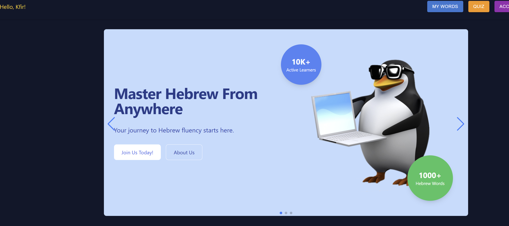
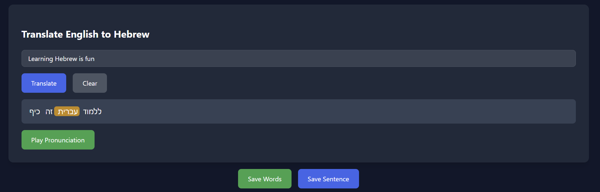
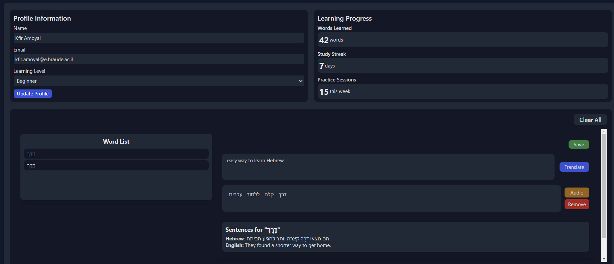
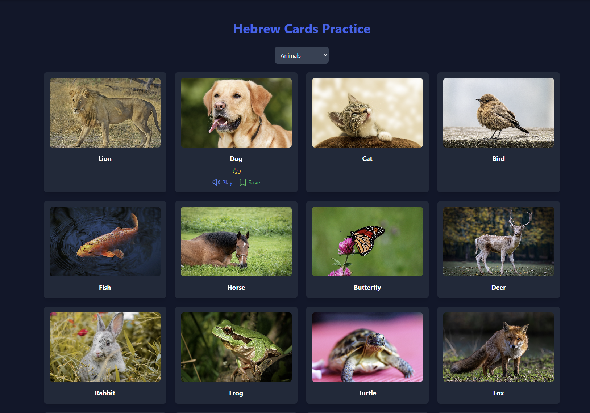

# AlefBet - Learn Hebrew Interactive Platform

Welcome to **AlefBet**! This platform allows users to:
- Translate and save words and sentences in Hebrew.
- Practice with a vocabulary quiz.
- Track progress using personalized learning statistics.
- Coming Soon - Hebrew chat with an AI bot.🤖

## ✨ Project Highlights

1. **Translation Module**: Translate English sentences to Hebrew and hear the pronunciation.
2. **User Dashboard**: Save and review favorite words and sentences.
3. **Quiz Section**: Challenge yourself to improve your Hebrew skills.
4. **Statistics**: Track daily practice, total words learned, and streaks.

---

## 📸 Screenshots

### 1. **Home Page**
   

### 2. **Translation Section**
   

### 3. **Quiz Page**
   

### 4. **Account Dashboard**
   

### 5. **Expand Vocabulary**

---

## ✉️ Contact Us

If you have any questions or feedback, feel free to reach out!

- 📱 **Phone Number**: +972 52707 6342
- ✉️ **Email**: [kfir.amoyal@e.braude.ac.il](mailto:kfir.amoyal@e.braude.ac.il)
- 🌍 **Location**: Snunit St 51, Karmiel, 2161002, Israel
- 🕒 **Working Hours**: Monday to Saturday | 9:00 AM to 6:00 PM

You can also submit a contact form directly through the **Contact Us** page on our platform.